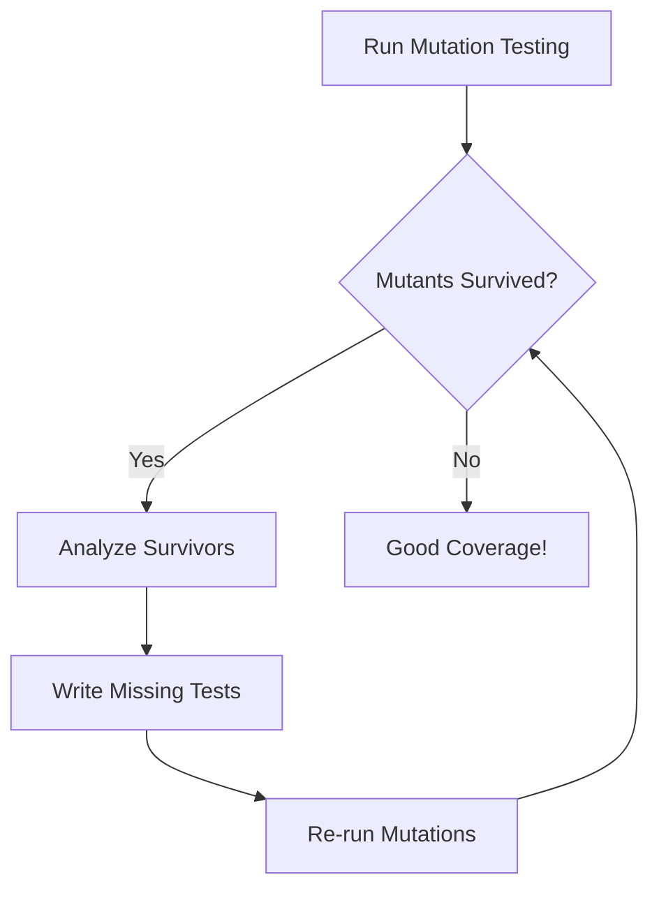

# Mutation Testing Guide

## What is Mutation Testing?

Mutation testing is a technique to evaluate the quality of your test suite by introducing small changes (mutations) to your code and checking if tests catch these changes. If a mutation survives (tests still pass), it indicates a gap in test coverage.

## Core Concepts

### Mutants

A mutant is a version of your code with one small, deliberate change. Common mutations include:

- **Arithmetic**: `+` → `-`, `*` → `/`
- **Relational**: `<` → `<=`, `==` → `!=`
- **Logical**: `&&` → `||`, `!` → (removed)
- **Constant**: `0` → `1`, `true` → `false`
- **Statement**: Remove statements or function calls
- **Return**: Change or remove return values

### Mutation Score

```
Mutation Score = (Killed Mutants / Total Mutants) × 100%
```

- **Killed**: Test suite detected the mutation (tests failed)
- **Survived**: Tests passed despite mutation (coverage gap)
- **Timeout**: Mutation caused infinite loop
- **Unviable**: Mutation created invalid code

Target: 80%+ mutation score for critical code

## Tool-Specific Guides

### Rust: cargo-mutants

#### Installation

```bash
cargo install cargo-mutants
```

#### Basic Usage

```bash
# Run mutation testing on entire project
cargo mutants

# Test specific package
cargo mutants -p my_package

# Test specific file
cargo mutants --file src/lib.rs

# Generate detailed JSON report
cargo mutants --json > mutants.json

# Run with timeout per test
cargo mutants --test-timeout 30

# Run in parallel (faster)
cargo mutants --jobs 4
```

#### Configuration

Create `.cargo/mutants.toml`:

```toml
# Exclude files from mutation
exclude_dirs = ["tests", "benches"]
exclude_globs = ["**/generated.rs"]

# Customize timeout
timeout_multiplier = 1.5

# Error on surviving mutants (CI)
error_on_survived = true
```

#### Interpreting Results

```
SURVIVED src/calculator.rs:45: replace + with - in add()
    → Your tests don't verify the addition operation properly

KILLED src/validator.rs:23: replace >= with > in check_age()
    → Good! Tests caught this boundary change

TIMEOUT src/loop.rs:67: replace < with <= in while loop
    → Mutation likely caused infinite loop
```

### Python: mutmut

#### Installation

```bash
pip install mutmut
```

#### Basic Usage

```bash
# Initialize mutmut
mutmut run --paths-to-mutate src/ --tests-dir tests/

# Show results summary
mutmut results

# Show surviving mutants
mutmut show

# Show specific mutant
mutmut show 47

# Apply mutant to see the change
mutmut apply 47

# Generate HTML report
mutmut html
```

#### Configuration

Create `.mutmut.yml`:

```yaml
paths_to_mutate:
  - src/

tests_dir: tests/

runner: python -m pytest

dict_synonyms:
  - dict
  - OrderedDict

exclude_patterns:
  - test_*
  - */migrations/*
```

#### Common Python Mutations

```python
# Original
def calculate_discount(price, rate):
    if rate > 0.5:
        rate = 0.5
    return price * (1 - rate)

# Mutations:
# 1. rate > 0.5 → rate >= 0.5
# 2. rate > 0.5 → rate < 0.5
# 3. rate = 0.5 → rate = 0.4
# 4. return price * (1 - rate) → return price * (1 + rate)
```

### JavaScript/TypeScript: Stryker

#### Installation

```bash
npm install --save-dev @stryker-mutator/core
npx stryker init  # Interactive setup
```

#### Configuration

`stryker.config.js`:

```javascript
module.exports = {
  mutate: ['src/**/*.js', '!src/**/*.test.js'],
  testRunner: 'jest',
  coverageAnalysis: 'perTest',
  thresholds: { high: 80, low: 60, break: 50 },
  mutator: {
    excludedMutations: ['StringLiteral'],
  },
};
```

#### Running Stryker

```bash
# Run mutation testing
npx stryker run

# Generate HTML report
npx stryker run --reporters html

# Run specific mutators
npx stryker run --mutate 'src/utils.js'
```

### Go: go-mutesting

#### Installation

```bash
go install github.com/zimmski/go-mutesting/cmd/go-mutesting@latest
```

#### Usage

```bash
# Run on package
go-mutesting ./...

# With specific test timeout
go-mutesting --timeout 10s ./...

# Generate report
go-mutesting --report mutations.json ./...
```

## Mutation Patterns and Strategies

### High-Value Mutations

Focus on mutations that reveal important test gaps:

1. **Boundary Mutations**: `<` → `<=`, `>` → `>=`
2. **Off-by-One**: `i` → `i+1`, `len-1` → `len`
3. **Null/Empty Checks**: Remove null checks
4. **Error Handling**: Change error returns
5. **Business Logic**: Invert conditions in domain rules

### Mutation Testing Workflow



### Analyzing Surviving Mutants

For each surviving mutant:

1. **Is it testable?** Some mutations might not affect observable behavior
2. **Is it important?** Focus on business logic over implementation details
3. **What test is missing?** Write a test that would kill this mutant
4. **Is the code necessary?** Surviving mutants might indicate dead code

## Common Mutation Categories

### Arithmetic Operator Mutations

```rust
// Original
let result = a + b;

// Mutations
let result = a - b;  // AOR (Arithmetic Operator Replacement)
let result = a * b;  // AOR
let result = a / b;  // AOR
let result = a % b;  // AOR
```

### Conditional Boundary Mutations

```rust
// Original
if x > 10 {

// Mutations
if x >= 10 {  // CBM (Conditional Boundary Mutation)
if x < 10 {   // ROR (Relational Operator Replacement)
if x == 10 {  // ROR
if true {     // COR (Conditional Operator Replacement)
if false {    // COR
```

### Logical Operator Mutations

```rust
// Original
if a && b {

// Mutations
if a || b {   // LOR (Logical Operator Replacement)
if !a && b {  // LCR (Logical Connector Replacement)
if a {        // Statement Deletion
```

### Return Value Mutations

```rust
// Original
return Some(value);

// Mutations
return None;           // RVM (Return Value Mutation)
return Some(value + 1); // RVM
// (return deleted)     // Statement Deletion
```

## Best Practices

### 1. Start Small

Begin with critical modules:
- Core business logic
- Security-sensitive code
- Frequently modified code
- Code with history of bugs

### 2. Set Realistic Goals

- 100% mutation coverage is rarely achievable or necessary
- Aim for 80%+ on critical code
- 60%+ on general application code
- Lower thresholds for UI/presentation code

### 3. Handle Equivalent Mutants

Some mutations don't change behavior:

```rust
// Original
let x = a * 0;

// Equivalent mutant (same result)
let x = a & 0;
```

Mark these as ignored in your tool configuration.

### 4. Optimize Performance

Mutation testing is slow. Speed it up:

- Run incrementally (only changed files)
- Use parallel execution
- Set reasonable timeouts
- Cache unchanged results
- Run in CI on pull requests only

### 5. Integrate with CI/CD

```yaml
# GitHub Actions example
- name: Run Mutation Tests
  run: |
    cargo mutants --error-on-survived --json > mutations.json
  continue-on-error: true

- name: Comment PR
  uses: actions/github-script@v6
  with:
    script: |
      const mutations = require('./mutations.json');
      // Post summary to PR
```

## Interpreting Results

### Good Mutations to Kill

```rust
// This mutation should be killed
fn calculate_tax(amount: f64) -> f64 {
    amount * 0.15  // → amount * 0.14
}
// Test should verify exact tax calculation
```

### Acceptable Survivors

```rust
// This mutation might survive acceptably
fn log_error(msg: &str) {
    eprintln!("Error: {}", msg);  // → println!
}
// If logging isn't tested, that might be OK
```

### Critical Survivors

```rust
// This MUST be killed
fn check_authorization(user: &User) -> bool {
    user.is_admin  // → !user.is_admin
}
// Security logic must be thoroughly tested
```

## Mutation Testing Anti-Patterns

### 1. Testing Implementation, Not Behavior

```rust
// Bad: Tests internal details
#[test]
fn test_uses_hashmap() {
    let cache = Cache::new();
    assert!(cache.internal_map.is_empty());  // Too specific
}

// Good: Tests behavior
#[test]
fn test_cache_starts_empty() {
    let cache = Cache::new();
    assert_eq!(cache.get("key"), None);
}
```

### 2. Mutation Score Gaming

Don't write useless tests just to kill mutants:

```rust
// Bad: Pointless test to kill mutant
#[test]
fn test_constant() {
    assert_eq!(BUFFER_SIZE, 1024);  // Tests a constant
}
```

### 3. Ignoring Timeout Mutants

Timeouts often indicate missing infinite loop tests:

```rust
// If this mutation causes timeout, add a test
while i < len {  // → while i <= len
    // ... process
    i += 1;
}
```

## Quick Reference

### Mutation Testing Checklist

- [ ] Install mutation testing tool for your language
- [ ] Configure exclusions (tests, generated code)
- [ ] Run on critical modules first
- [ ] Analyze surviving mutants
- [ ] Write tests to kill important survivors
- [ ] Set mutation score thresholds
- [ ] Integrate into CI pipeline
- [ ] Document equivalent mutants
- [ ] Review results regularly

### Recommended Thresholds by Code Type

| Code Type | Target Score | Minimum |
|-----------|-------------|---------|
| Security | 90%+ | 85% |
| Business Logic | 85%+ | 75% |
| Data Processing | 80%+ | 70% |
| Controllers | 70%+ | 60% |
| UI/Views | 60%+ | 40% |
| Utilities | 75%+ | 65% |